  <!-- Dynamic Hero Banner -->
  <picture>
    <source media="(prefers-color-scheme: dark)" srcset="./dark.svg">
    <source media="(prefers-color-scheme: light)" srcset="./light.svg">
    
  </picture>

 

<h2 data-importer="text" align="left">Hi 👋! My name is Nishchay and I'm a Computer Science Student, from India.</h2>

  
  
  
  
  
  

 

### 💫 About Me

* 🔭 **I’m currently working on** architecting intelligent backend systems and developing high-performance machine learning solutions.
* 👯 **I’m looking to collaborate on** open-source AI/ML projects and scalable web applications.
* 🤝 **I’m looking for help with** optimizing machine learning models for production and advanced deployment strategies.
* 🌱 **I’m currently learning** advanced system design and integrating complex AI models into scalable web architectures.
* 💬 **Ask me about** Python, Flask, C/C++, Machine Learning, and backend architecture.
* ⚡ **Fun fact:** I can debug a complex C++ segmentation fault faster than I can decide what to watch on Netflix.

---

### 💻 Tech Stack

  <!-- Core Languages -->
  
  
  
  
  
  
  
  
  
  
  <!-- Frameworks & Data Science -->
  
  
  
  
  
  
  <!-- Databases & Tools -->
  
  
  
  
  

---

### 📊 GitHub Analytics

  <!-- Pacman Contribution Graph -->
  <picture data-importer="pacman">
    <source media="(prefers-color-scheme: dark)" srcset="https://raw.githubusercontent.com/maurodesouza/maurodesouza/pacman-output/pacman-contribution-graph-dark.svg?game=pacman">
    <source media="(prefers-color-scheme: light)" srcset="https://raw.githubusercontent.com/maurodesouza/maurodesouza/pacman-output/pacman-contribution-graph.svg?game=pacman">
    
  </picture>
  
  
    
  
  
  
  
    
  
  
  
    

  

  

    
  
  

    
  
  

